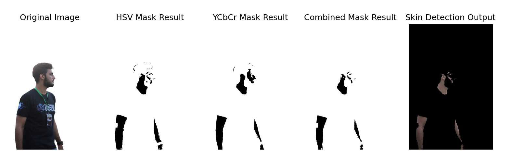
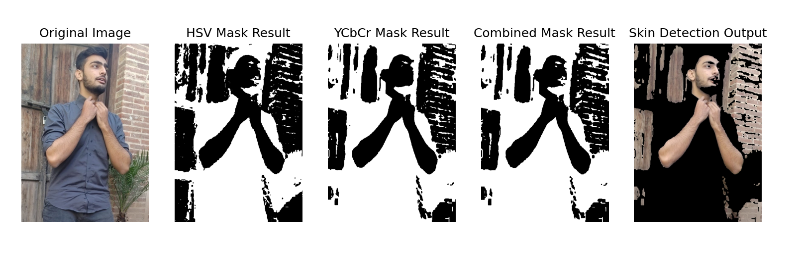
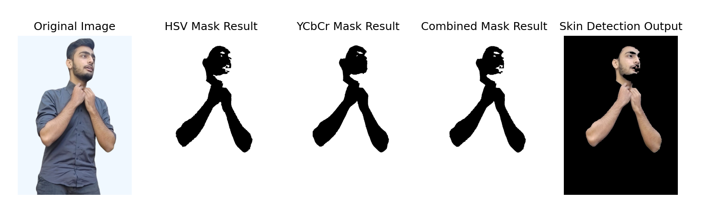

---

# 🖼️ Todo 1: Skin Color Detection

**Slide Name**: Fundamentals of Computer Vision  
**Slide No**: 16  

This task detects skin regions in an image using a combination of the **HSV** and **YCbCr** color spaces. The goal is to test the program on both your own and other images for skin detection accuracy.

## 📋 Description

- Converts the image to **HSV** and **YCbCr** color spaces.
- Creates masks based on predefined skin tone ranges.
- Combines both masks for better accuracy.

### Output

Below are sample results showing the original image, HSV mask, YCbCr mask, and the combined result:

With background:

Without background:

With background:

Without background:

---
