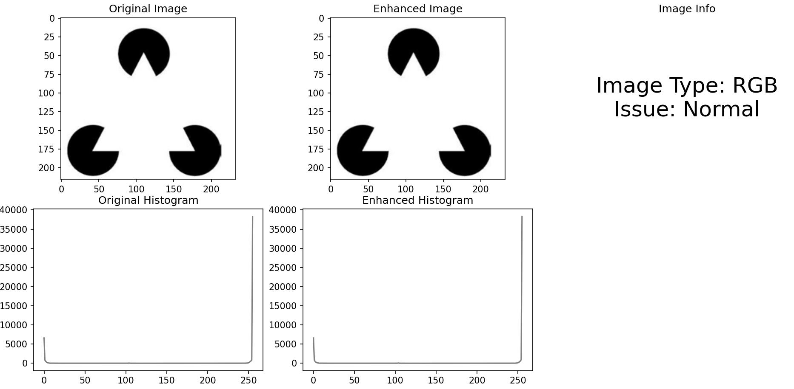
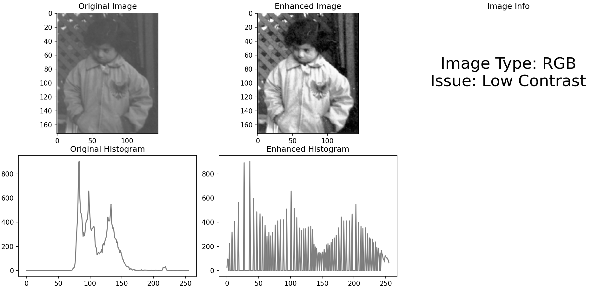
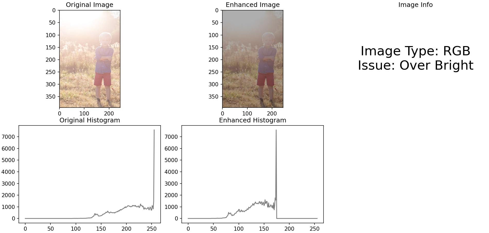
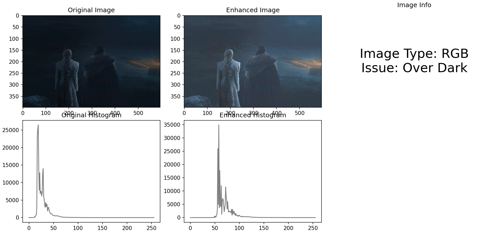

---

# Analysis and Fix Image

**Slide Name**: Fundamentals of Computer Vision  
**Slide No**: 27

**Exercise**: Analyze and enhance images based on their intensity and histogram characteristics.

## Overview

This project implements a systematic approach to analyzing images and enhancing them based on identified issues. The following steps are performed:

1. **Determine Image Type**: Identify if the image is binary, grayscale, or RGB.
2. **Analyze Histogram**: Assess the image's histogram to detect if it is over dark, over bright, low contrast, or normal.
3. **Enhance Image**: Apply specific enhancement techniques based on the detected issue:
   - Increase brightness and contrast for over dark images.
   - Reduce brightness for over bright images.
   - Apply histogram equalization for low contrast images.
4. **Display Results**: Present the original and enhanced images alongside their histograms and information about the image type and issues.

## How It Works

The program begins by loading an image from a specified path, then proceeds through the analysis and enhancement process:

1. **Loading Image**: The image is read using OpenCV.
2. **Image Type Detection**: The program checks the dimensions of the image to classify it.
3. **Histogram Analysis**: The histogram is calculated, and thresholds are set to determine the image's condition.
4. **Enhancement Techniques**: Different techniques are applied based on the identified issue, enhancing the image for better visibility and contrast.
5. **Visualization**: Results are displayed using Matplotlib, showing the original and enhanced images along with their histograms.

## Results

The following outputs demonstrate the results after analysis and enhancement:

### Original vs Enhanced Image

---
