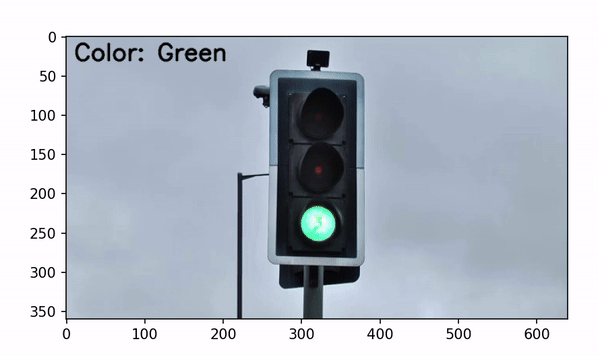

---

# Traffic Light Detection in Video

**Slide Name**: Fundamentals of Computer Vision  
**Slide No**: 76 

**Exercise**: Detect traffic light colors from video frames and display them in real-time.

## Overview

This project implements a system for detecting traffic light colors from video frames using computer vision techniques. The program processes each frame of the video, determines the color of the traffic light, and overlays the detected color name onto the frame for visualization.

## How It Works

1. **Video Input**: The program captures video from the specified file path.
2. **Color Detection**: Each frame is analyzed to detect the color of the traffic light using the HSV color space. The color detection works by creating masks for red, yellow, and green colors and counting the number of pixels in each mask.
3. **Display Frames**: The detected color name is overlaid on the frame, which is displayed in real-time using Matplotlib.

## Code Explanation

### Key Functions

- **`detect_traffic_light_color(frame)`**: 
  - Converts the input frame to HSV color space.
  - Defines HSV ranges for red, yellow, and green colors.
  - Creates masks for each color and counts the non-zero pixels to determine the dominant color.

- **`process_video_with_matplotlib(video_path)`**: 
  - Opens the specified video file and reads it frame by frame.
  - Calls the `detect_traffic_light_color` function for each frame.
  - Overlays the detected color on the frame and displays it using Matplotlib.

## Example Usage

To test the program, replace the `video_path` variable with the path to your video file containing traffic lights. 

```python
video_path = 'signal.mp4'  # Replace with your video path
process_video_with_matplotlib(video_path)
```

## Results

The output is a real-time display of video frames, where each frame shows the detected traffic light color overlaid on the video.



---
