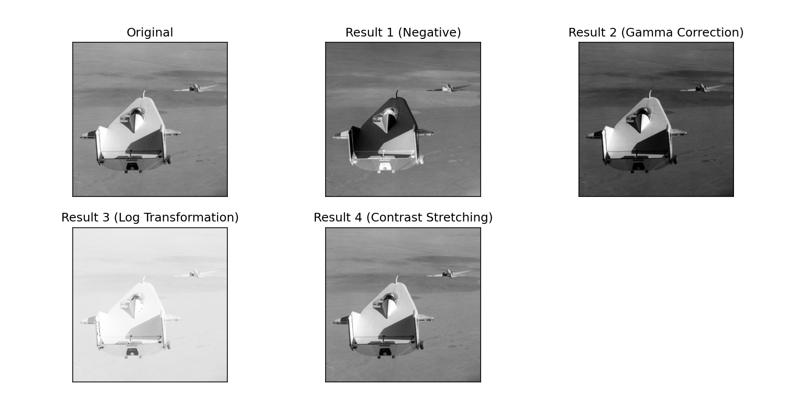

---

# Intensity Transformation

Slide Name: Fundamentals of Computer Vision
Slide No: 24

This project demonstrates various intensity transformations applied to a grayscale image, including:

- Negative Transformation
- Gamma Correction
- Log Transformation
- Contrast Stretching

## Results

---
